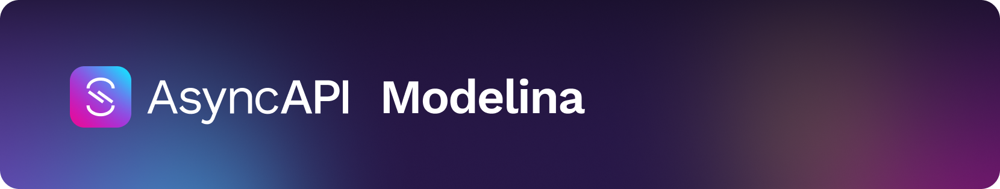

## Hi there 👋
Is this a CV? Logbook? Highlights? Maybe a bit of all. Currently hired by Postman, as part of their <a href="https://blog.postman.com/announcing-postman-open-technologies/">Open Technologies Team</a>, as a Lead Software Engineer working on <a href="https://github.com/orgs/asyncapi">AsyncAPI</a> full time.

# These are the projects I am working on 🔭

<table  style="table-layout: fixed; width: 100%;">
  <tr>
    <td colspan="1">
     While it is my day job, this is my spare-time project as well and is my main focus at the moment. I am part of the <a href="https://www.asyncapi.com/community/tsc">AsyncAPI Technical Steering Committee</a> and maintain a bunch of tools. I am/was also the release coordinator for AsyncAPI 3.0.0, so know my way around all repositories within the organization.
    </td>
  </tr>
  <tr style="vertical-align: top;">
    <td><h1><a href="https://github.com/GamingAPI/">GamingAPI</a></h1>
<a href="https://gamingapi.org/">GamingAPI.org</a> is a side project of mine where I try to use everything from AsyncAPI (tooling and spec) and incorporate it into a standard for interacting with all types of game servers (focus on <a href="https://rust.facepunch.com/">Rust</a>, upcoming Minecraft, etc.) through generated SDK's, documentation, governance, and more!
</td>
  </tr>
</table>

# Tooling
Here are all the tools I am actively maintaining regardless of what my day job is.

<table style="table-layout: fixed; width: 100%;">
  <tr>
    <td colspan="2">
    <h2 align="center"><b>Where I spend most of my time</b></h1>
    </td>
  </tr>
  <tr>
    <td colspan="2">
    <a href="https://github.com/asyncapi/modelina">Modelina</a> is a library I started with <a href="https://github.com/magicmatatjahu">Maciej</a>, which is for generating models from various inputs (AsyncAPI, OpenAPI, JSON Schema, TypeScript models, etc) into various outputs (TypeScript, C#, Python, etc) in a highly customizable, and extendable. It is built to support different serialization libraries (XML, JSON, bytes, etc) so you can adapt the models directly to your need.    Try the playground here: <a href="https://www.asyncapi.com/modelina">asyncapi.com/modelina</a>  Find a bunch of examples here: <a href="https://github.com/asyncapi/modelina/tree/master/examples#examples">modelina examples</a>
    </td>
  </tr>
  <tr style="vertical-align: top;">
    <td><a href="https://github.com/asyncapi/EDAVisualiser/">EDAVisualiser</a> is a library first making its appearance in the <a href="https://studio.asyncapi.com/">AsyncAPI Studio</a>, and is built to better visualize a single application (from AsyncAPI input or core building blocks) of it's outgoing and incoming external operations to others. It can also be a complex system comprised of multiple applications. It allows this through something called <a href="https://github.com/asyncapi/EDAVisualiser#views">views</a>. It of course supports all the major design frameworks, React, Next, Vue, Angular, etc.   Try the playground here: <a href="asyncapi.github.io/EDAVisualiser">asyncapi.github.io/EDAVisualiser</a>
    </td>
    <td>
     Want to generate anything from an AsyncAPI document? Yep, this is the library to use then! The AsyncAPI <a href="https://github.com/asyncapi/generator">generator</a> can be used in combination with templates to generate some kind of output (code, documentation, configuration files, you name it).
    </td>
  </tr>
</table>
<table style="table-layout: fixed; width: 100%; vertical-align: top;">
  <tr>
    <td colspan="3">
    <h2 align="center"><b>Where I spend less time, but actively maintain</b></h1>
    </td>
  </tr>
  <tr style="vertical-align: top;">
    <td>
    <h3>.Net/C# NATS template</h3> Generate a <a href="https://github.com/asyncapi/dotnet-nats-template">.Net/C# NATS library wrapper</a> for your AsyncAPI document.
    </td>
    <td>
    <h3>TypeScript NATS template</h3> Generate a <a href="https://github.com/asyncapi/typescript-nats-template">TypeScript NATS library wrapper</a> for your AsyncAPI document.
    </td>
    <td>
    Used by the AsyncAPI generator to <a href="https://github.com/asyncapi/generator-react-sdk">render React templates</a> as an alternative to Nunjucks templating.
    </td>
  </tr>
  <tr style="vertical-align: top;">
    <td>
     A <a href="https://github.com/asyncapi/dotnet-nats-template">JavaScript parser</a> providing a way to interact with your AsyncAPI documents.
    </td>
    <td>
    <h3>GH Action for bumping .NET versions</h3> <a href="https://github.com/jonaslagoni/gh-action-dotnet-bump">Automatically bump .NET/C# version</a> of libraries, by following semantic release.
    </td>
    <td>
    <h3>GH Action for bumping AsyncAPI documents</h3> <a href="https://github.com/jonaslagoni/gh-action-asyncapi-document-bump">Automatically bump the application version for AsyncAPI documents</a> by following semantic release.
    </td>
  </tr>
</table>

  
Here is a list of all the previous libraries and projects I have worked on.

- https://github.com/jonaslagoni/Wizard-Of-Treldan, university group project, 2d and 2 different UI games in one, with a custom game engine, written in Java.
- https://github.com/jonaslagoni/NEON, university group project, a 2d tower defense game, using OSGi to use a modular system to load and unload towers, maps, game modes, etc on the fly, build upon libgdx, written in Java.
- https://github.com/jonaslagoni/csgoLiveServer, spare time project trying to reflect what happens in a CSGO server in the web browser, first version of GamingAPI I guess.
- https://github.com/jonaslagoni/asyncapi-quicktype-template, AsyncAPI generator template to generate typed models with QuickType. 
- https://github.com/jonaslagoni/asyncapi-quicktype-filter, the core library code for the QuickType template.
- https://github.com/jonaslagoni/.NET-websocket-client-template, an old AsyncAPI generator template for generating a WebSocket wrapper in .NET.
- https://github.com/jonaslagoni/ts-websocket-server-template, an old AsyncAPI generator template for generating a WebSocket wrapper in TypeScript.
- https://github.com/jonaslagoni/Java-to-JSON-Schema, a JSON Schema draft-7 DSL for writing JSON Schema through code in Java. 
- https://github.com/jonaslagoni/Java-to-AsyncAPI, an AsyncAPI DSL for writing AsyncAPI documents through code in Java. Uses the JSON Schema variant as well internally to define payloads.

## Writings
I am using [eventstack.tech/posts](https://eventstack.tech/posts) as my personal sanctuary for writing stuff about the projects, updates, and different tech stuff.

Here is an overview of the subjects so far:
- Automated code generation ([introduction](https://eventstack.tech/posts/automated-utopia), [versioning](https://eventstack.tech/posts/automated-utopia-versioning), for [TypeScript libraries](https://eventstack.tech/posts/automated-utopia-typescript), for [.NET libraries](https://eventstack.tech/posts/automated-utopia-dotnet))
- AsyncAPI Governance ([getting started](https://eventstack.tech/posts/getting-started-with-governance), in practice [part 1](https://eventstack.tech/posts/enforcing-consistency-guidelines-part-1), [part 2](https://eventstack.tech/posts/enforcing-consistency-guidelines-part-2))
- API versioning ([theory](https://eventstack.tech/posts/versioning-is-easy), [in practice](https://eventstack.tech/posts/asyncapi-versioning-in-practice))
- [Reusability in AsyncAPI causing problems](https://eventstack.tech/posts/reusability-causing-problems)
- AsyncAPI tooling updates (week [30](https://eventstack.tech/posts/asyncapi-tooling-update-1), [33](https://eventstack.tech/posts/asyncapi-tooling-update-week-33), [39](https://eventstack.tech/posts/asyncapi-tooling-update-week-39), [46](https://eventstack.tech/posts/asyncapi-tooling-update-week-46))

## Conferences
This section is more for me than you, trying to keep track of what I am participating in or have.

  
Here is a list of previous conferences and speaking arrangements in case you find it interesting.

  
- (speaking) APIDays conference Helsinki, 2024, in-person, gave a talk about `Navigating the jungle of the AsyncAPI Ecosystem`
- (speaking) AsyncAPI conference, at Sngular Madrid, 2023, in-person (watch the recording here: https://www.youtube.com/live/FN5eR1Zqh9c?si=A4gxOaJlHCg4ID3P&t=7038)
- (participating) AsyncAPI conference, at IBM London, 2023, in-person
- (speaking) APIDays Paris 2022, in-person, gave a talk about `AsyncAPI and schema format complexity`
- (participating) GOTO Copenhagen 2022, in-person
- (participating) Digital Transformation World, TMForum, Copenhagen 2022, in-person
- (speaking) AsyncAPI conference 2022, had two talks here. The two talks were `Next Generation of AsyncAPI` (watch the recording here: https://www.youtube.com/watch?v=WOMDYzHh-3w) and `The Intricacies of a Single Keyword in AsyncAPI` (watch the recording here: https://www.youtube.com/watch?v=fLAAXAXOGlE)
- (speaking) API:World 2021, online, talked about `How AsyncAPI can enhance your developer experience`
- (speaking) APIDays Interface 2021, online, talked about `How AsyncAPI can enhance your developer experience`. Watch the recording here: https://www.youtube.com/watch?v=W7L0ryT3Qmo
- (participating) Info Security Denmark 2021, in-person
- (participating) APIDays Paris 2019, in-person, invitation by [Fran](https://github.com/fmvilas)
- (participating) Info Security Denmark 2019, in-person

